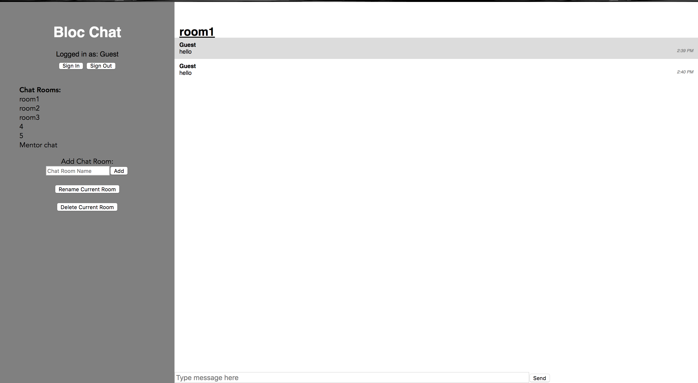

# 90's music audio player


## Description

A chat box build with React.JS. Responsive front-end design done with Bootstrap

View the <a href = "https://infinite-tor-10968.herokuapp.com/">site</a>

## Technologies & Tools

* React

* Bootsrap

* Firebase 

* HTML

* CSS 

## Installation and Usage

### Requirements:

* Node.js installed
* Firebase's account
### Steps:
1. Clone repo on your local machine:
```
$ git clone https://github.com/mkavo92/chat-room
```
2. Install dependencies:
```
$ cd chat-room
$ npm install
```
3. Execute the app:<br/>
```
$ npm start
```

4. App now running on localhost:3000